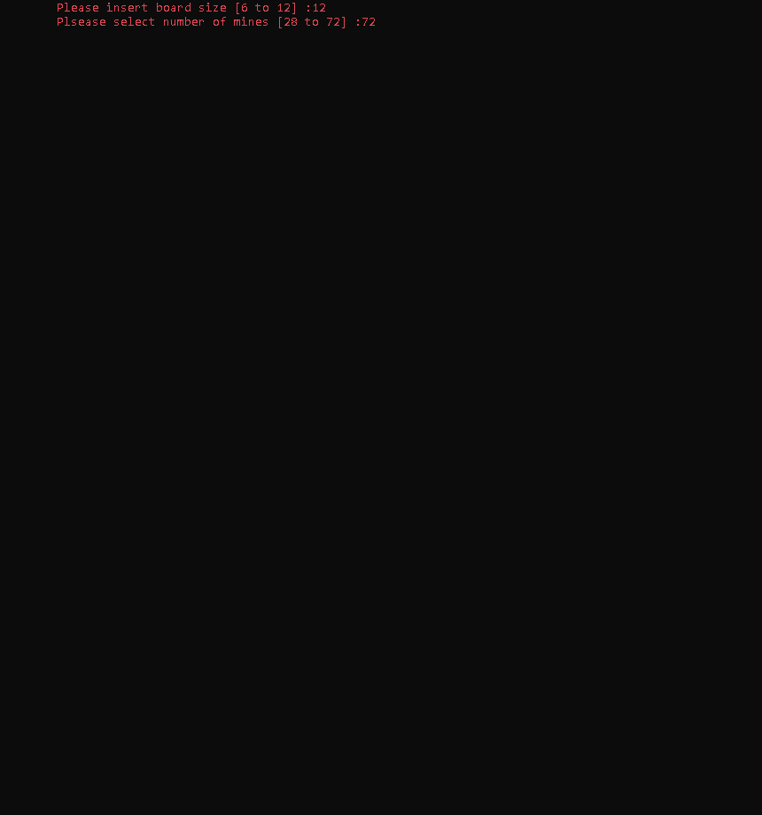
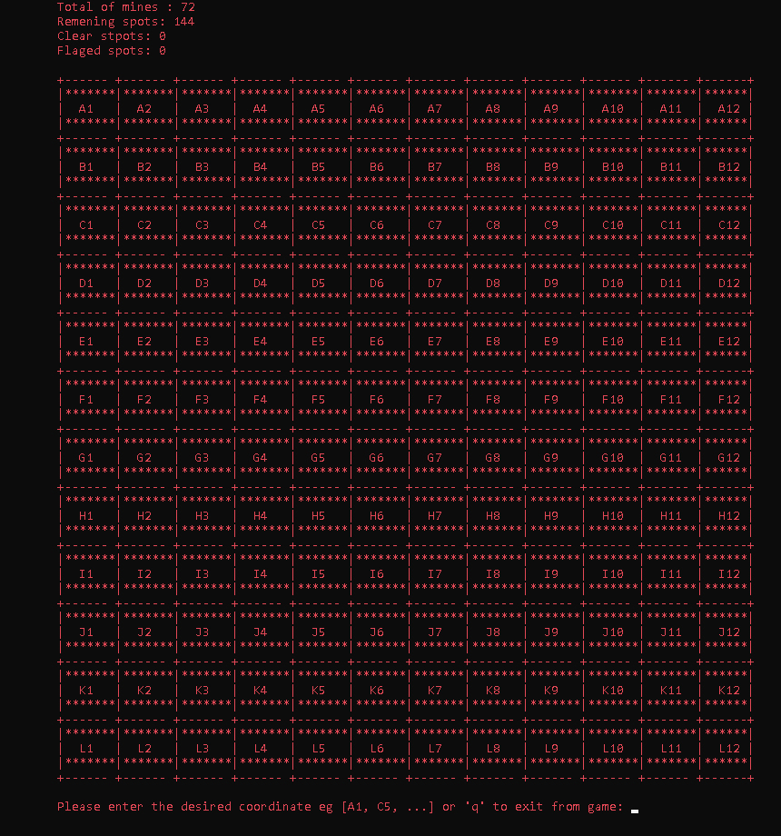
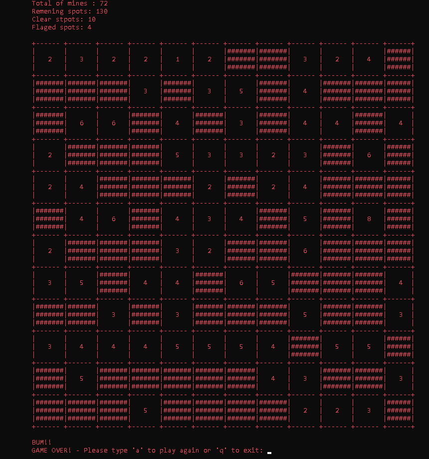

<h1 align="center">Minesweeper</h1>

Minesweeper is a classic single-player puzzle game, where the objective is to clear a minefield without detonating any mines. This implementation of Minesweeper was built using Python and features a customizable game board, adjustable difficulty levels, and a scoring system.

&nbsp;

<h2>Installation</h2>

To install Minesweeper, follow these steps:

1. Clone this repository to your local machine.
2. Navigate to the project directory in your terminal or command prompt.
3. Run `python minesweeper.py` to launch the game.

Minesweeper requires Python 3 to be installed on your machine.

<h2>Usage</h2>

To play Minesweeper, simply use your mouse or keyboard to select a square on the game board. The game board is filled with squares, some of which contain mines that will explode when clicked. The numbers on each square indicate how many adjacent squares contain mines. Your objective is to clear the board of all squares that do not contain mines, without detonating any mines.

Minesweeper also features adjustable difficulty levels, which can be set by changing the size of the game board and the number of mines.

<h3>Example</h3>

Here are some screenshots of the Minesweeper game:

<table>
  <tr>
    <td></td>
    <td></td>
  </tr>
  <tr>
    <td></td>
    <td></td>
  </tr>
</table>

<h2>Contributions</h2>

If you find any bugs or issues with Minesweeper, please feel free to report them by opening an issue on this repository.

<h2>License</h2>

This project is licensed under the MIT License. See the LICENSE.md file for more information.

<h2>Connect with me:</h2>

If you have any questions, feedback or just want to connect, feel free to reach out to me on LinkedIn.

